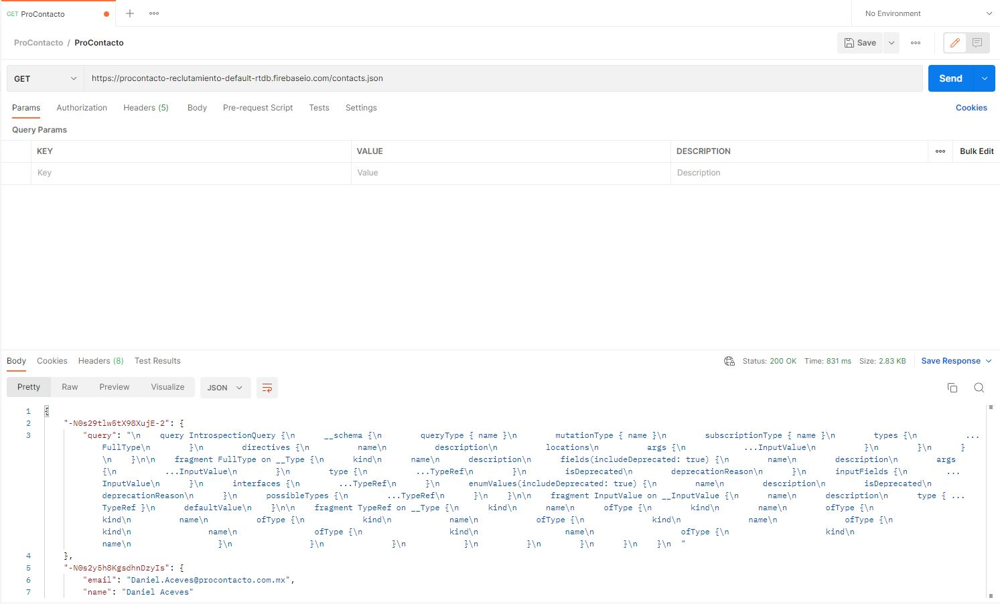
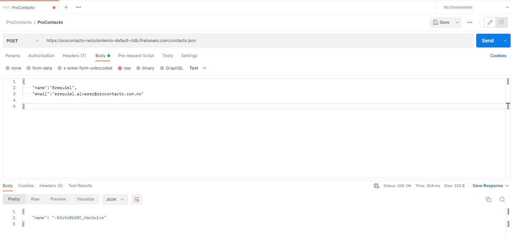
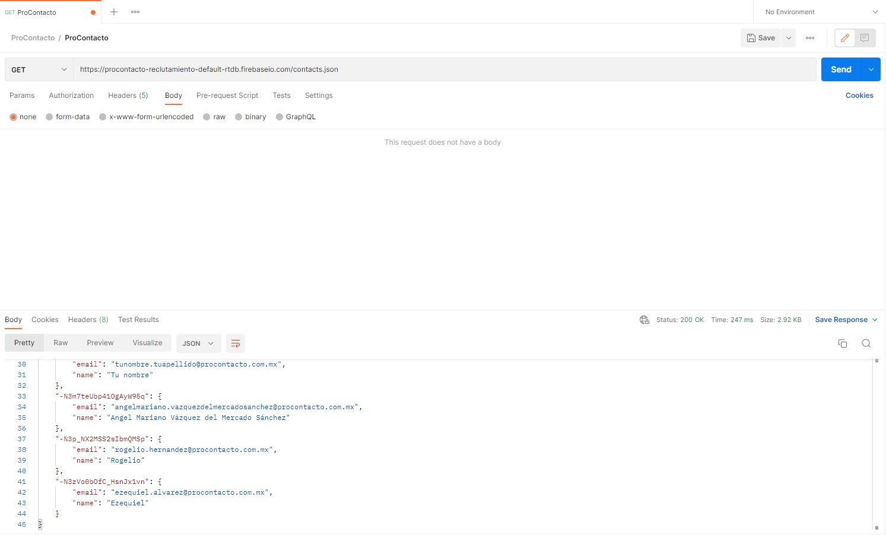
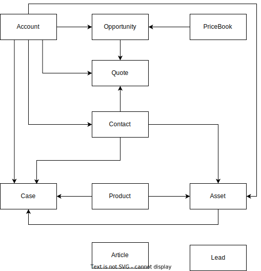

<h4 align="left">
  
</h4>

*Alvarez Ezequiel Osvaldo.*

EVALUACIÓN PRÁCTICA
===================

Índice de Actividades
------

  - [Ejercicio Número 2](#ejercicio-número-2)

  - [Ejercicio Número 3](#ejercicio-número-3)

  - [Ejercicio Número 4](#ejercicio-número-4)
  
  - [Ejercicio Número 5](#ejercicio-número-5)

  - [Ejercicio Número 6](#ejercicio-número-6)

  - [Ejercicio Número 7](#ejercicio-número-7)

___

Ejercicio Número 2
------------------

1. Un servidor Hypertext Transfer Protocol, por sus siglas HTTP, en castellano, Protocolo de Transferencia de Hipertexto, es utilizada en páginas webs, dónde su labor es conectar una "página" con otra (de manera informal), es decir, devolver información cuando recibe peticiones del usuario. HTTP especifica cómo transferir hypertext entre dos computadoras.

2. Los verbos de HTTP es una forma de realizar **peticiones** al servidor. Los más populares son:
   - GET
   - PATCH
   - POST
   - PUT
   - DELETE
   - Hay otros verbos como los son: HEAD, TRACE, OPTIONS y CONNECT

3. En una comunicación HTTP, "Request" significa "solicitud" o "petición", y "response", "respuesta". El request es enviado por el cliente, solicitando una petición al servidor, el mismo servidor, devuelve una respuesta a dicha solicitud, mediante un response. Es la forma de comunicación mediante una página web y el servidor que la aloja. Los headers o cabeceras HTTP son los que permiten al cliente y al servidor, enviar información adicional junto a una petición o respuesta respectivamente.

4. Query String significa cadena de consulta, es utilizado para realizar interracciones con una base de datos. En cuanto a la URL, es la parte dónde podemos enviar información al servidor.

5. El responseCode es el código de estado de respuesta en HTTP, indican si se ha completado satisfactoriamente una solicitud HTTP específica. Hay distintos valores posibles a devolver, los cuales son:
   - Respuestas informativas (100–199)
   - Respuestas satisfactorias (200–299)
   - Redirecciones (300–399)
   - Errores de los clientes (400–499)
   - Errores de los servidores (500–599)
6. GET lleva los datos de forma "visible" al cliente. El medio de envío es la URL. Los datos los puede ver cualquiera. Y POST consiste en datos "ocultos", enviados por un formulario cuyo método de envío es post. Los datos no son visibles.

7. Cuando se accede a una página web desde el navegador, se utiliza el verbo HTTP "GET", dicho verbo es el que permite realizar consultas directas al servidor, donde el mismo, otorga una respuesta (en este caso, la visualización de dicha página web). Cabe destacar que el verbo "GET" no causa efectos secundarios en el servidor, no prduce nuevos registros ni modifica los existentes.

8. JSON es un formato de datos basado en texto. Las E.D. de JSON, son cadenas útiles cuando se quiere transmitir datos a través de una red. Las E.D. XML son utilizadas para almacenar e intercambiar datos estructurados. Define la estructura y el significado de los datos.

- Ejemplo JSON:

~~~json
{   "person" :{
    "firstName": "Jonathan",
    "lastName": "Freeman",
    "loginCount": 4,
    "isWriter": true,
    "worksWith": ["Spantree Technology Group", "InfoWorld"],
    "pets": [
        {
            "name": "Lilly",
            "type": "Raccoon"
        }
    ]}
}
~~~

- Ejemplo XML:

~~~xml
<?xml version="1.0"?>
<person>
    <first_name>Jonathan</first_name>
    <last_name>Freeman</last_name>
    <login_count>4</login_count>
    <is_writer>true</is_writer>
    <works_with_entities>
        <works_with>Spantree Technology Group</works_with>
        <works_with>InfoWorld</works_with>
    </works_with_entities>
    <pets>
        <pet>
            <name>Lilly</name>
            <type>Raccoon</type>
        </pet>
    </pets>
</person>
~~~

9. SOAP es un protocolo estándar que define cómo dos objetos en diferentes procesos pueden comunicarse por medio de intercambio de datos XML. Es esencial para los servicios web. Los buscadores, las tiendas en línea y otros muchos servicios en Internet funcionan a través de dichos servicios web, y SOAP es uno de los protocolos que lo hacen posible.

10.  REST es un conjunto de principios arquitectónicos que se ajusta a las necesidades de las aplicaciones móviles y los servicios web ligeros. Se usa en el sentido más amplio para describir cualquier interfaz entre sistemas que utilice directamente HTTP para obtener datos o indicar la ejecución de operaciones sobre los mismos.

11.  Los HTTP headers son la parte central de los HTTP requests y responses, y transmiten información acerca del navegador del cliente, de la página solicitada, del servidor, etc. Content-Type se utiliza para decirle al cliente que tipo de contenido será retornado

Ejercicio Número 3
------------------

1. Imagen adjunta a la resolución:

2. Imagen adjunta a la resolución:

3. Imagen adjunta a la resolución:

En cuanto a las diferencias entre la llamada 1 y 3, se dan cuando se ha realizado el "POST", ya que en la misma se ha ingresado el nombre y el email establecido en el body del dicho verbo HTTP. Así posteriormente cuando se realiza un "nuevo" "GET", otorga como respuesta la información cargada anteriormente en el body del "POST", como se ha mencionado.

Ejercicio Número 4
-----------------

Resolución de los módulos solicitados de Trailhead: [Perfil](https://trailblazer.me/id?lang=es_MX)

Ejercicio Número 5
------------------

1. **Lead**: Son los candidatos potenciales que demostraron interés en un producto o servicio de la organización. Y sus datos que almacena de forma estándar son:

   - Lead Information: Name, Phone, Mobile, Last Name, Company, Email, Website, Title, Lead Source, Lead Status, Rating, Industry, Annual Revenue, No. of Employees.

   - Adress Information: Street, Zip, City, State/Province, Country.

   - Additional Information: Product Interest, Current Generator(s), SIC Code, Primary, Number of Locations.

   - Description Information: Description.

2. **Account**: Sinónimo de "empresa" u "organización", dónde se encontraran oportunidades, contactos, entre otras cosas. Y sus datos que almacena de forma estándar son:

    - Account Information: Rating, Phone, Fax, Website, Ticker Symbol, Ownership, Employees, SIC Code, Annual Revenue, Industry, Type, Account Site, Account Number, Parent Account, Account Name.

    - Address Information: Billing Address, Shipping Address.

    - Additional Information: Additional Information, SLA, SLA Expiration Date, SLA Serial Number, Number of Locations, Upsell Oportunity, Active.
    - Description Information: Description.

3. **Contact**: Son personas que trabajan al interior de las empresas. Y sus datos que almacena de forma estándar son:

    - Contact Information: Phone, Home Phone, Name, Last Name, Account Name, Mobile, Other Phone, Fax, Email, Assistant, Asst. Phone, Title, Department, Birthdate, Reports To, Lead Source,Loan Amount.

    - Address Information: Mailing Address, Other Address.

    - Additional Information: Languages, Level.

    - Description Information: Description

4. **Opportunity**: Son las potenciales oportunidades de ventas para la oferta de un producto. Y sus datos que almacena de forma estándar son:

   - Opportunity Information: Amount, Close Date, Next Step, Stage, Probability (%), Primary Campaign Source, Lead Source, Type, Account Name, Opportunity Name, Private.

   - Additional Information: Order Number, Main Competitor(s), Delivery/Installation Status, Current Generator(s), Tracking Number.

   - Description Information: Description.

5. **Product**: Es el o los productos que la organización ofrece. Y sus datos que almacena de forma estándar son:

   - Product Information: Product Name, Active, Product Family, Product Code, Product Description.

6. **PriceBook**: Es el objeto que permite crear una lista de precios en sí. Y sus datos que almacena de forma estándar son:

   - PiceBook Information: Price Book Name, Active, Is Standard Price Book, Description.

7. **Quote**: El objeto Quote representa una cotización, muestra los precios propuestos para productos y servicios. Y sus datos que almacena de forma estándar son:

   - Quote Information: Account Name, Additional To, Additional To Name, Bill To, Bill To Name, Contact Name, Contract, Description, Discount, Email, Expiration Date, Fax, Grand Total, Line Items, Opportunity Name, Owner Name, Phone, Quote Name, Quote Number, Quote To, Quote To Name, Shipping and Handling, Ship To, Ship To Name, Status, Subtotal, Syncing, Tax, Total Price.

8. **Asset**: Los activos representan los productos específicos que los clientes han comprado. Y sus datos que almacena de forma estándar son:

   - Asset Information: Asset Name, Account, Contact, Product, Serial Number, Competitor Asset, Purchase Date, Install Date, Status, Usage End Date, Quantity, Price, Description.

9. **Case**: Representa un asunto o un problema del cliente, Y sus datos que almacena de forma estándar son:

   - Case Information: Status, Priority, Case Origin, Contact Name, Account Name, Type, Case Reason, Case Number.

   - Web Information: Web Email, Web Company, Web Phone, Web Name.

   - Additional Information: Product, Engineering Req Number, SLA Violation, Potential Liability.

   - Description Information: Subject, Description, Internal Comments.

10. **Article**: Este objeto se puede utilizar para asociar un artículo con categorías de datos de un grupo de categorías de datos o para consultar las selecciones de categoría de un artículo. Y sus datos que almacena de forma estándar son:

    - Article Information: DataCategoryGroupName, DataCategoryName, ParentId.

**RELACIONES ENTRE LOS OBJETOS**: En base a la observación y el análisis de las relaciones entre los objetos mediante la herramienta Schema Builder de Salesforce, obtuve el siguiente diagrama.

Para más precisión y exactitud sobre el diagrama de relaciones de objetos standard de Salesforce, revisar la documentación del mismo. [Sales Cloud Data Model](https://architect.salesforce.com/1/asset/immutable/s/a566708/assets/images/data-models/sales-cloud-overview-data-model.png) y [Product & Price Book Data Model](https://architect.salesforce.com/1/asset/immutable/s/694cdeb/assets/images/data-models/sales-cloud-product-price-book-data-model.png)

Ejercicio Número 6
------------------

**Soluciones de Salesforce**:

1. Es una empresa de software conocida por producir un CRM llamado Sales Cloud
2. Sales Cloud forma parte del sistema CRM que ofrece Salesforce. Sales Cloud está creado especialmente para comerciales de ventas.
3. Los Service Cloud son infraestructuras, plataformas o sistemas de software que alojan los proveedores externos y que se ponen a disposición de los usuarios a través de Internet con el fin de almacenar, administrar y procesar datos, servidores, bases de datos, redes y software.
4. Salesforce Health Cloud es una plataforma que permite gestionar de forma integral la relación médico-paciente.
5. Salesforce Marketing Cloud es una plataforma que provee servicios de análisis y automatización de marketing digital.

**Funcionalidades de Salesforce**:

1. Un RecordType es lo que nos permite definir diferentes Business Process, Pages Layouts y Picklist Values en un determinado objeto.
2. Un ReportType es una API para obtener información sobre qué tipos de informes están disponibles en una organización
3. Una Page Layout es la herramienta que te permite controlar la posición y la organización de los campos, y también las listas relacionadas que están visibles a los usuarios, cuando se visualiza un registro
4. Un Compact Layout es la herramienta que permite devolver el diseño compacto principal para un conjunto de objetos.
5. Un perfil es el que define cómo acceden los usuarios a objetos y datos, y qué pueden hacer en la aplicación.
6. El rol es el que te permite controlar el nivel de visibilidad que un usuario tiene sobre los datos de una organización.
7. Las Validation Rule verifican que los datos que un usuario ingresa en un registro, cumplan con los estándares que se especifican antes de que el usuario pueda guardar el registro.
8. Lookup vinculan dos objetos para poder “buscar” un objeto en los elementos relacionados del otro objeto. Mientras que Master Detail, un objeto es el principal y otro es el detalle. El objeto principal controla determinados comportamientos del objeto de detalle
9. Los Sandbox son copias de una organización de Salesforce que se puede usar para desarrollo, pruebas y capacitación, sin comprometer los datos y las aplicaciones.
10. ChangeSet es la herramienta que permite enviar personalizaciones de una organización de Salesforce a otra.
11. Import Wizard es la herramienta que permite importar datos en objetos estándar y objetos personalizados. Permite importar hasta 50.000 registros a la vez
12. Web to Lead permite diseñar un formulario incluyendo las preguntas más adecuadas para cada tipo de negocio con el objetivo de insertarlo en un blog o una web corporativa, automatizando así la captación de leads y la integración de los datos de los usuarios en el CRM.
13. Web to Case recopila las solicitudes de servicio de atención al cliente directamente del sitio web de una empresa y genera automáticamente "cases" nuevos.
14. Omnichannel permite obtener información casi en tiempo real sobre la disponibilidad del inventario en todas las ubicaciones.
15. Chatter es una herramienta de comunicación dentro de Salesforce, diseñada especialmente para la interacción y retroalimentación en tiempo real, el intercambio de archivos y la utilización de encuestas, entre otras características.

**Conceptos generales**:

1. SaaS, es una forma de poner a disposición softwares y soluciones de tecnología por medio de internet, como un servicio. Con este modelo, no se necesita instalar, mantener y actualizar hardwares y softwares.
2. SalesForce es SaaS ya que otorga soluciones tecnologicas por medio de la nube en forma de servicio. Como puede ser: Sales Cloud.
3. Una solución Cloud es la forma de implementar software en la nube como método resolutivo a ciertas necesidades o problemas.
4. On Premise se refiere a que la instalación del programa se ha realizado de manera local, y obligando a esta a crear una infraestructura informática compleja con servidores que requieren mantenimiento.
5. El pipeline de ventas es una herramienta de gestión que se usa para observar las etapas de ventas con ciclos medios o largos. De esta forma, un vendedor acelera el ciclo de ventas, transformando clientes potenciales en clientes en sí.
6. El funnel de ventas es una representación gráfica del "camino" o las etapas por las que pasa un usuario en su proceso para convertirse en un cliente.
7. El Customer Experience es “el recuerdo que se genera en la mente del consumidor como consecuencia de su relación con la marca”.
8. La omnicanalidad es una estrategia que utiliza todos los canales de comunicación de una empresa. Tiene como objetivo fortalecer la relación cliente/empresa, por eso, busca ofrecer una experiencia consistente en todos los canales.
9. El B2B es un modelo de negocio que consiste en los servicios que una compañía entrega a otra con el objetivo de mejorar las ventas de los productos y bienes que ofrece. B2C, es un modelo de negocio en el que una empresa le vende de forma directa al consumidor final. La palabra KPI significa “indicadores claves de desempeño”. Estos indicadores son todas las variables, factores y unidades de medida que sirven para generar una estrategia de marketing.
10. La API es la herramienta que presenta funciones y reglas que permiten la interacción y comunicación entre diferentes aplicaciones. La diferencia entre una API y una REST API se encunetra en que la mayoría de las API siguen el formato aplicación-aplicación, en cambio, la API REST opera en el concepto web de Cliente-Servidor.
11. El procesamiento batch, es el proceso mediante el cual una computadora completa lotes de trabajos, a menudo simultáneamente, en orden secuencial y sin parar. Se caracterizan porque su ejecución no precisa ningún tipo de interacción con el usuario.
12. Kanban es una metodología que ayuda a los equipos a encontrar un equilibrio entre el trabajo que necesitan hacer y la disponibilidad de cada miembro de los mismos. El objetivo es gestionar de manera general cómo se van completando las tareas.
13. ERP es un sistema de software que ayuda a gestionar un negocio, incluyendo los procesos de finanzas, recursos humanos, fabricación, cadena de suministro, servicios, compras, y más. Está compuesto por módulos integrados o aplicaciones de negocio que se hablan entre sí y comparten una base de datos común.
14. SalesForce es un ERP ya que comparte la misma base de datos independientemente del área que trabaje con los mismos en una misma organización. Además permite la comunicación entre ellos, de esta manera, otorgando mejores resultados a futuro.

Ejercicio Número 7
------------------

1. Se ha recibido el archivo .CSV para la realización del importe de datos mediante DataLoader. Primero se ha realizado una preparación previa del archivo, se han eliminado columnas redundantes que poseían la misma información de datos, se han organizado los mismos quitando "comas" (',') y reemplazandolo por otro caracter, de esta manera se elimina la confusión de caracteres en cuanto al archivo .CSV final. Luego de dicho proceso se ha subido el archivo a la aplicación, adjunto screenshots con el procedimiento.

Se establece el objeto en el que se desea cargar los datos. Luego de lo mencionado, se carga el archivo.CSV.

Se mapean los campos del archivo con los campos existentes del objeto estándar.

Se pone a correr el proceso de subida de los datos.

Luego de todo el proceso se obtiene la confirmación de la carga de los datos. 

(Para el objeto de oportunidades se ha realizado el mismo procedimiento que hemos mencionado anteriormente. Es redundante volver a mencionarlo.)

2. Listado dónde se muestran las cuentas importadas con sus respectivos campos mediante el método de carga de datos realizado con anterioridad.

